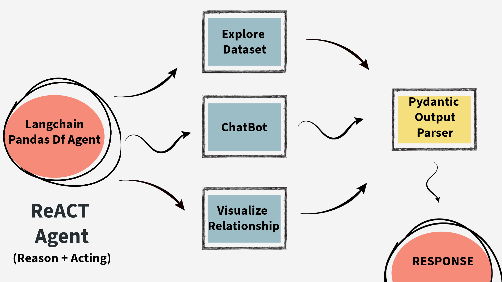

# 🤖 GenAI Data Assistant with LLAMA3-70B

## 🪼 Introduction
This project demonstrates the integration of various tools and libraries to create a powerful AI-powered data analysis interface. It leverages the capabilities of LLM, Langchain Agentic Framework, Streamlit & Pydantic to provide a comprehensive solution for **exploring**, **analyzing**, and **visualizing** data.

## 🗃️ About the Project
This project aims to develop a user-friendly streamlit web application that assists users in understanding and extracting insights from their datasets. Key features include:

- **Data Exploration**: Users can easily explore and analyze their data using the provided tools.
- **Visualization**: The application generates informative visualizations to help users understand relationships and trends within their data.
- **Chatbot Interaction**: A chatbot interface allows users to ask questions and receive relevant responses based on their data.


## 🦜 Langchain Framework and How it is Used
Langchain serves as the backbone of this project, providing a framework for building and deploying language models. In this project, we've imported LLAMA3 70B model through [GROQ API](https://groq.com/).




Demistifying the workflow:
The agent uses the Langchain ReACT approach which combines both reasoning and acting. The LLM finds the best approach by observing results and accordingly acts in the way of using tool i.e. PythonREPL Tool for this case.

## 🔮 Accessing the Streamlit App

To access the Streamlit app, follow these steps:

- Clone the repository:
```shell
git clone https://github.com/PragyanTiwari/ai-assistant.git
```
- Configure the `.env` file:
```shell
# get the groq api key from official website
GROQ_API_KEY = "" 
```
- Run the streamlit app in terminal
```shell
streamlit run app.py
```

Once the app is running, you can access it in your web browser.

