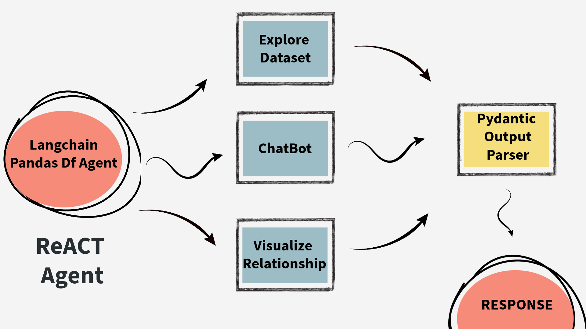

# 🤖 GenAI Data Assistant with Gemini API

## Introduction
Groq API Powered GenAI-Assistant which analyzes data and summarizes the data in a proper format. Two features it provides:

## About the Project

- **Explore Dataset** : Explore the dataset with generative summary of the dataset. Interpreting all the descriptive statistics about the dataset using pandas agent.

- **Chatbot** : Chat with your dataset. Attempts to solve simple query conversation.

- **Visualize Relationships** : Generate plots to visualize relationship with the help of generative AI. It uses PythonREPL Tool to generate code and get executed through streamlit.

## What is Langchain

###
